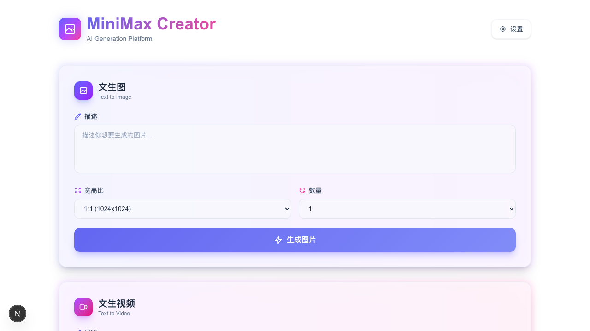

# MiniMax Creator

<p align="center">
  
</p>

> An elegant AI creation tool that brings creativity to your fingertips

📖 [中文版](./README_ZH.md)

✨ **MiniMax Creator** is an intelligent creation platform based on MiniMax API, supporting three core features: Text-to-Image, Text-to-Video, and Text-to-Music generation. Its clean and modern interface lets you focus on creation itself.

## Features

### 🎨 Text to Image
- Multiple aspect ratios supported: 1:1, 16:9, 4:3, 9:16, etc.
- Generate 1-9 images per request
- Smart Prompt optimization
- 24-hour valid image links

### 🎬 Text to Video
- Multiple resolutions: 720P, 768P, 1080P
- Flexible duration: 6s or 10s
- Camera movement support: `[Zoom In]`, `[Zoom Out]`, `[Pan Left]`, etc. (15 camera movements)
- Real-time task status tracking

### 🎵 Text to Music
- Instrumental and vocal music creation
- Professional lyric structure tags: `[Verse]`, `[Chorus]`, `[Bridge]`
- Multiple audio format outputs
- AI-powered lyric generation

## Tech Stack

- **Framework**: Next.js 16 + React 19
- **Language**: TypeScript
- **Styling**: Tailwind CSS 4
- **API**: MiniMax Open Platform

## Quick Start

### Requirements
- Node.js 18+
- MiniMax API Key

### Installation

```bash
# Clone the project
git clone https://github.com/JDChi/minimax_creator.git
cd minimax_creator

# Install dependencies
npm install

# Start development server
npm run dev
```

Visit [http://localhost:3000](http://localhost:3000) to start using.

### Configuration

First-time users need to configure API Key:

1. Click "Settings" in the top right corner
2. Enter your MiniMax API Key
3. Base URL usually doesn't need modification (default: `https://api.minimaxi.com`)
4. Click "Save Configuration"

## Project Structure

```
src/
├── app/
│   ├── page.tsx              # Home page
│   ├── settings/page.tsx    # Settings page
│   └── api/minimax/         # API proxy
│       ├── image/            # Text to Image
│       ├── video/            # Text to Video
│       └── music/            # Text to Music
├── components/               # UI components
├── lib/                     # Utilities
└── types/                   # Type definitions
```

## Development Commands

| Command | Description |
|---------|-------------|
| `npm run dev` | Start development server |
| `npm run build` | Build for production |
| `npm run test` | Run tests (watch mode) |
| `npm run test:run` | Run tests (single run) |

## Acknowledgements

- [MiniMax](https://platform.minimaxi.com) - Providing powerful AI generation capabilities
- [Next.js](https://nextjs.org) - Modern React framework
- [Tailwind CSS](https://tailwindcss.com) - Efficient CSS framework

---

<p align="center">
  Made with ❤️ by <a href="https://github.com/JDChi">JDChi</a>
</p>
